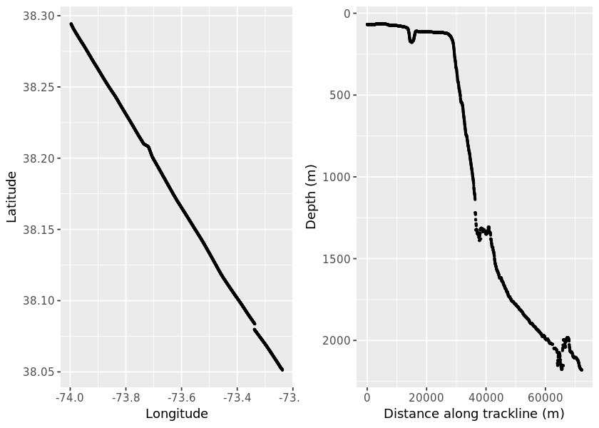
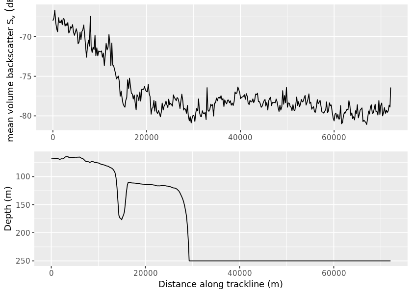

## 1. Backscatter - remote sensing in the ocean
<p> </p>
<p>Reflections. No, I’m not talking about contemplating your existence within the Tidyverse or understanding
what that spline did to your data. I’m talking about echoes. Specifically, sound echoes called “backscatter.” Marine scientists use backscatter to understand the distribution of organisms in the ocean.</p>
<p>In this analysis, we are going to wrangle active acoustic data and plot the mean volume backscatter associated with fish with swim-bladders in relation to bathymetry (depth of the sea floor).</p>
<p>These acoustic data were collected from a research vessel that crossed the shelf break in the Mid-Atlantic Bight (<a href="https://data.nodc.noaa.gov/cgi-bin/iso?id=gov.noaa.ngdc.mgg.wcd:HB1103_EK60">NOAA cruise HB1103</a>) and were preprocessed using the software, <a href="https://www.echoview.com/">Echoview</a>.</p>


```R
# Load the libraries
library(tidyverse)
library(lubridate)
library(geosphere)
library(gridExtra)

# Read in the depth data
bottom <- read_csv("datasets/bottom_line.csv", col_types = cols(Ping_date = col_datetime(format = "%m/%d/%Y")))

# Inspect the first six rows
glimpse(bottom)
```

    Observations: 2,766
    Variables: 10
    $ Ping_date         <dttm> 2011-06-18, 2011-06-18, 2011-06-18, 2011-06-18, ...
    $ Ping_time         <time> 09:53:37, 09:53:42, 09:58:47, 09:58:52, 09:58:57...
    $ Ping_milliseconds <int> 725, 741, 866, 866, 866, 866, 882, 882, 882, 882,...
    $ Latitude          <dbl> 999.00000, 38.29771, 38.29429, 38.29424, 38.29418...
    $ Longitude         <dbl> 999.00000, -74.00185, -73.99677, -73.99666, -73.9...
    $ Position_status   <int> 4, 3, 1, 1, 1, 1, 1, 1, 1, 1, 1, 1, 1, 1, 1, 1, 1...
    $ Depth             <dbl> 68.60377, 68.60024, 68.78515, 68.77859, 68.37986,...
    $ Line_status       <int> 1, 1, 1, 1, 1, 1, 1, 1, 1, 1, 1, 1, 1, 1, 1, 1, 1...
    $ Ping_status       <int> 0, 0, 0, 0, 0, 0, 0, 0, 0, 0, 0, 0, 0, 0, 0, 0, 0...
    $ Altitude          <dbl> -9.9e+37, 0.0e+00, 0.0e+00, 0.0e+00, 0.0e+00, 0.0...


```R
# These packages need to be loaded in the first @tests cell. 
library(testthat) 
library(IRkernel.testthat)

soln_bottom <- read_csv("datasets/bottom_line.csv", col_types = cols(Ping_date = col_datetime(format = "%m/%d/%Y")))

run_tests({
    test_that("packages are loaded", {
        expect_true("tidyverse" %in% .packages(), info = "Did you load the tidyverse package?")
        expect_true("lubridate" %in% .packages(), info = "Did you load the lubridate package?")
        expect_true("geosphere" %in% .packages(), info = "Did you load the geosphere package?")
        expect_true("gridExtra" %in% .packages(), info = "Did you load the gridExtra package?")
    })
    
    test_that("bottom data loaded correctly", {
        expect_is(bottom, "tbl_df", info = "Did you read in bottom_line with read_csv?")
        expect_equal(bottom, soln_bottom, info = "bottom contains the wrong values. Did you import the correct .csv file?")
        expect_identical(as.character(bottom$Ping_date[1]), "2011-06-18", info = "Did you use the correct format in col_date()?" )
    })
})

```


    <ProjectReporter>
      Inherits from: <ListReporter>
      Public:
        .context: NULL
        .end_context: function (context) 
        .start_context: function (context) 
        add_result: function (context, test, result) 
        all_tests: environment
        cat_line: function (...) 
        cat_tight: function (...) 
        clone: function (deep = FALSE) 
        current_expectations: environment
        current_file: some name
        current_start_time: 23.476 0.304 23877.355 0.005 0
        dump_test: function (test) 
        end_context: function (context) 
        end_reporter: function () 
        end_test: function (context, test) 
        get_results: function () 
        initialize: function (...) 
        is_full: function () 
        out: 3
        results: environment
        rule: function (...) 
        start_context: function (context) 
        start_file: function (name) 
        start_reporter: function () 
        start_test: function (context, test) 


## 2. What is the "shelf break"?
<p></p>
<p>The red line in the map above is the ship's track across the shelf break in the Mid-Atlantic Bight. But what is the "shelf break"? It's “The Big Drop-off!”. It's the underwater version of a cliff. In most marine ecosystems the shelf break is also a highly dynamic and productive area that provides homes and excellent buffets for many marine species. The smallest phytoplankton to the largest marine mammals, sharks, seabirds, tunas, and sea turtles - they all use this area at some point in their life cycles. And, we’re going to play with some active acoustic data from this fantastic region!</p>
<p>But first, let's clean up the bathymetry (depth) data and get it ready for plotting.</p>


```R
# Clean the bottom data
bottom_clean <- bottom %>%
    filter(Position_status == 1) %>%
    select(Ping_date, Ping_time, Latitude, Longitude, Depth) %>%
    mutate(DT = Ping_date + Ping_time,
       dist = c(0, distHaversine(cbind(Longitude[-n()], Latitude[-n()]),
                                 cbind(Longitude[ -1], Latitude[ -1]))),                         
       distalong = cumsum(dist),
       t_diff = c(NA, difftime(DT[ -1], DT[-n()], units = "secs")),
       m_per_sec = dist/t_diff)
  
# Inspect the first six rows
glimpse(bottom_clean)
```

    Observations: 2,764
    Variables: 10
    $ Ping_date <dttm> 2011-06-18, 2011-06-18, 2011-06-18, 2011-06-18, 2011-06-...
    $ Ping_time <time> 09:58:47, 09:58:52, 09:58:57, 09:59:02, 09:59:07, 09:59:...
    $ Latitude  <dbl> 38.29429, 38.29424, 38.29418, 38.29411, 38.29404, 38.2939...
    $ Longitude <dbl> -73.99677, -73.99666, -73.99653, -73.99641, -73.99627, -7...
    $ Depth     <dbl> 68.78515, 68.77859, 68.37986, 68.37986, 68.37986, 68.3803...
    $ DT        <dttm> 2011-06-18 09:58:47, 2011-06-18 09:58:52, 2011-06-18 09:...
    $ dist      <dbl> 0.00000, 11.47956, 12.77948, 13.24406, 14.17050, 15.34577...
    $ distalong <dbl> 0.00000, 11.47956, 24.25904, 37.50310, 51.67360, 67.01937...
    $ t_diff    <dbl> NA, 5, 5, 5, 5, 5, 5, 5, 5, 5, 5, 5, 5, 5, 5, 5, 5, 5, 5,...
    $ m_per_sec <dbl> NA, 2.295913, 2.555895, 2.648813, 2.834099, 3.069153, 3.0...


```R
soln_bottom_clean <- soln_bottom %>%
  filter(Position_status == 1)  %>%
  select(Ping_date, Ping_time, Latitude, Longitude, Depth) %>%
  mutate(DT = Ping_date + Ping_time,                      
         dist = c(0,distHaversine(cbind(Longitude[-n()], Latitude[-n()]),
                                  cbind(Longitude[ -1], Latitude[ -1]))),                         
         distalong = cumsum(dist),                                         
         t_diff = c(NA, difftime(DT[ -1], DT[-n()], units = "secs")),      
         m_per_sec = dist/t_diff)                                          


run_tests({
    test_that("correct columns were selected", {
        expect_identical(colnames(soln_bottom_clean), colnames(bottom_clean), 
                info = "Did you select the correct columns? Is there a typo?")
    })
    
    test_that("m_per_sec is calculated correctly", {
        expect_identical(round(bottom_clean$m_per_sec[3], 6), 2.555895, info = "Did you divide `dist` by  `t_diff`?")   
    })
})
    
```


    <ProjectReporter>
      Inherits from: <ListReporter>
      Public:
        .context: NULL
        .end_context: function (context) 
        .start_context: function (context) 
        add_result: function (context, test, result) 
        all_tests: environment
        cat_line: function (...) 
        cat_tight: function (...) 
        clone: function (deep = FALSE) 
        current_expectations: environment
        current_file: some name
        current_start_time: 23.536 0.304 23877.415 0.005 0
        dump_test: function (test) 
        end_context: function (context) 
        end_reporter: function () 
        end_test: function (context, test) 
        get_results: function () 
        initialize: function (...) 
        is_full: function () 
        out: 3
        results: environment
        rule: function (...) 
        start_context: function (context) 
        start_file: function (name) 
        start_reporter: function () 
        start_test: function (context, test) 


## 3. Where ever you go, there you are
<p>Now that we have removed the bad data points and calculated the cumulative distance the ship traveled, let's plot the data to see if our calculation makes sense. A horizontal view of the ship's track will show us if the ship deviated from the track line or if there were any breaks in the data. A plot of the depth of the sea floor along the track line will show us the position of the shelf break. In a spatial analysis of the track line data, we would typically work in the packages <code>sp</code> and <code>sf</code>, but that's a topic all its own. For now, we'll create a couple of track line plots with the latitude, longitude, depth, and distance along the track line.</p>


```R
# Reduce the size of the plots
options(repr.plot.width = 7, repr.plot.height = 5)

# Plot the ship's track
p_LonLat  <- ggplot(bottom_clean, aes(Longitude, Latitude)) +
  geom_point(size=0.5)

# Plot the depth of the sea floor along the ship's track
p_bthy  <-  ggplot(bottom_clean, aes(distalong, Depth)) +
  geom_point(size=0.5)+
    scale_y_reverse()+
  labs(x = "Distance along trackline (m)", y = "Depth (m)")

# Arrange the plots side by side for easier viewing
grid.arrange(p_LonLat, p_bthy, nrow = 1)
```





```R
stud_LonLat <- p_LonLat
stud_bthy <- p_bthy

soln_LonLat <- ggplot(soln_bottom_clean, aes(Longitude, Latitude)) +
                  geom_point(size = 0.5)

soln_bthy <- ggplot(soln_bottom_clean, aes(distalong, Depth)) +
                  geom_point(size = 0.5) +
                  scale_y_reverse() +
                  labs(x = "Distance along trackline (m)", y = "Depth (m)")

run_tests({
    test_that("plots are drawn correctly", {
        expect_s3_class(stud_LonLat, "ggplot") 
        expect_identical(stud_LonLat$data, soln_LonLat$data, info = 'The plot data is incorrect. Did you use `bottom_clean`?')
        expect_s3_class(stud_bthy, "ggplot") 
        expect_identical(stud_bthy$data, soln_bthy$data, info = 'The plot data is incorrect. Did you use `bottom_clean`?')
        })
    
    test_that("plots use correct x and y", {    
        expect_identical(deparse(stud_LonLat$mapping$x),deparse(soln_LonLat$mapping$x),
            info = 'The `x` aesthetic in p_LonLat is incorrect. Did you map it to `Longitude`?')      
        expect_identical(deparse(stud_bthy$mapping$x),deparse(soln_bthy$mapping$x),
            info = 'The `x` aesthetic in p_bthy is incorrect. Did you map it to `Longitude`?')  
        expect_identical(deparse(stud_LonLat$mapping$y),deparse(soln_LonLat$mapping$y),
            info = 'The `y` aesthetic in p_LonLat is incorrect. Did you map it to `Latitude`?')      
        expect_identical(deparse(stud_bthy$mapping$x),deparse(soln_bthy$mapping$x),
            info = 'The `y` aesthetic in p_bthy is incorrect. Did you map it to `Latitude`?')  
    })
    
    test_that("correct geoms were used", {
        expect_identical(class(stud_LonLat$layers[[1]]$geom)[1],class(soln_LonLat$layers[[1]]$geom)[1],
            info = 'There is no point layer in p_LonLat. Did you call `geom_point()`?')
        expect_identical(class(stud_bthy$layers[[1]]$geom)[1],class(soln_bthy$layers[[1]]$geom)[1],
            info = 'There is no point layer in p_bthy. Did you call `geom_point()`?')
        })
    
     test_that("the correct size parameter was used", {
        expect_identical(stud_LonLat$layers[[1]]$aes_params$size, soln_LonLat$layers[[1]]$aes_params$size,
            info = 'The size of the points in p_LonLat is incorrect. Did you set `size` to `0.5`?')
        expect_identical(stud_bthy$layers[[1]]$aes_params$size, soln_bthy$layers[[1]]$aes_params$size,
            info = 'The size of the points in p_bthy is incorrect. Did you set `size` to `0.5`?')
         })
    
    test_that("y axis was reversed", {
        expect_lt(ggplot_build(p_bthy)$layout$panel_scales_y[[1]]$range$range[1], 0,
                 label = "Did you reverse the y-axis? See the documentation link in the instructions.")
    })
})
   

```


    <ProjectReporter>
      Inherits from: <ListReporter>
      Public:
        .context: NULL
        .end_context: function (context) 
        .start_context: function (context) 
        add_result: function (context, test, result) 
        all_tests: environment
        cat_line: function (...) 
        cat_tight: function (...) 
        clone: function (deep = FALSE) 
        current_expectations: environment
        current_file: some name
        current_start_time: 24.053 0.308 23877.935 0.005 0
        dump_test: function (test) 
        end_context: function (context) 
        end_reporter: function () 
        end_test: function (context, test) 
        get_results: function () 
        initialize: function (...) 
        is_full: function () 
        out: 3
        results: environment
        rule: function (...) 
        start_context: function (context) 
        start_file: function (name) 
        start_reporter: function () 
        start_test: function (context, test) 


## 4. What's the difference?
<p>It looks like the straight track line isn't so straight. This happens quite often with data collected in this area. There is a lot of fishing gear in the shelf break region of the Mid-Atlantic Bight, and sometimes the ship must divert from the track line to avoid it. It is also possible that the GPS signal was lost for a few minutes. Let's find out what the difference is between the straight-line length of the track line (start point to endpoint) and the cumulative distance the ship traveled.</p>
<p>Calculating the difference between the cumulative meters traveled and the straight-line distance of the track line is a common task - a perfect time to create a function to use on other track line data files!</p>


```R
# Create the function
distance_diff <- function(bottom_data){
  cumulative_dist <- last(bottom_data$distalong)
  start <- cbind(first(bottom_data$Longitude), first(bottom_data$Latitude))
  end <- cbind(last(bottom_data$Longitude), last(bottom_data$Latitude))
  straight_line_dist <-  distHaversine(start, end)
  return(round(cumulative_dist - straight_line_dist, 1))
}

# Run distance_diff on the cleaned bottom data
distance_diff(bottom_clean)
```


513.3


```R
soln_distance_diff <- function(bottom_data){
  cumulative_dist <- last(bottom_data$distalong)
  start <- cbind(first(bottom_data$Longitude), first(bottom_data$Latitude))
  end <- cbind(last(bottom_data$Longitude), last(bottom_data$Latitude))
  straight_line_dist <-  distHaversine(start, end)
  return(round(cumulative_dist - straight_line_dist, 1))
}

dd <- soln_distance_diff(bottom_clean)

run_tests({
    test_that("distance_diff() works on the bottom_clean", {
        expect_is(distance_diff, "function")
        expect_s3_class(bottom_clean, "data.frame")    
        expect_equal(dd, distance_diff(bottom_clean),
            info = "`distance_diff()` does not produce the correct result. 
                    Make sure to use `first()` to get the `start` values and `last()` to get the `end` values." )
    })    
   })
```


    <ProjectReporter>
      Inherits from: <ListReporter>
      Public:
        .context: NULL
        .end_context: function (context) 
        .start_context: function (context) 
        add_result: function (context, test, result) 
        all_tests: environment
        cat_line: function (...) 
        cat_tight: function (...) 
        clone: function (deep = FALSE) 
        current_expectations: environment
        current_file: some name
        current_start_time: 24.115 0.308 23877.997 0.005 0
        dump_test: function (test) 
        end_context: function (context) 
        end_reporter: function () 
        end_test: function (context, test) 
        get_results: function () 
        initialize: function (...) 
        is_full: function () 
        out: 3
        results: environment
        rule: function (...) 
        start_context: function (context) 
        start_file: function (name) 
        start_reporter: function () 
        start_test: function (context, test) 


## 5. Here fishy, fishy, fishy...
<p>In the grand scheme of track line diversions, a 513-meter difference isn't too bad. This difference could play a larger or small role in the data analysis depending on the ecological question being asked. For now, we'll keep it in mind as we load, clean, and plot out the acoustic data.</p>
<p>Volume backscatter is the integration of all the returned echoes within the sampling volume. It's a measure of the relative density of organisms. In this case, because we preprocessed the data in <a href="https://www.echoview.com/">Echoview</a> to look for fish-like scattering, our final plot of the volume backscatter data, <code>Sv_mean</code>, will give us an indication of the distribution of fish along the track line.</p>
<p>Will there be sections of the track line with higher/lower densities if fish? Let's find out!</p>


```R
# Read in the acoustic data
acoustic <- read_csv("datasets/acoustic_LgSBF.csv", col_types = cols(Date_M = col_datetime(format = "%Y%m%d")))  %>% 
  filter(Lon_M != 999.0)

# Glimpse the data
glimpse(acoustic)
```

    Observations: 724
    Variables: 78
    $ Process_ID                           <int> 20216, 20216, 20216, 20216, 20...
    $ Interval                             <int> 4, 5, 6, 7, 8, 9, 10, 11, 12, ...
    $ Layer                                <int> 1, 1, 1, 1, 1, 1, 1, 1, 1, 1, ...
    $ Sv_mean                              <dbl> -67.97805, -67.65053, -66.6586...
    $ NASC                                 <dbl> 365.6001, 429.4046, 539.5769, ...
    $ Sv_max                               <dbl> -53.93325, -54.51390, -51.3186...
    $ Sv_min                               <dbl> -88.67275, -87.36100, -88.9946...
    $ Sv_noise                             <dbl> -967.8684, -967.6432, -967.623...
    $ NASC_noise                           <int> 0, 0, 0, 0, 0, 0, 0, 0, 0, 0, ...
    $ Height_mean                          <dbl> 53.25000, 58.00000, 58.00000, ...
    $ Depth_mean                           <dbl> 39.04617, 39.00000, 39.00000, ...
    $ Good_samples                         <int> 639, 522, 464, 464, 406, 464, ...
    $ Layer_depth_min                      <int> 0, 0, 0, 0, 0, 0, 0, 0, 0, 0, ...
    $ Layer_depth_max                      <int> 250, 250, 250, 250, 250, 250, ...
    $ Ping_S                               <int> 2, 14, 23, 31, 39, 46, 54, 61,...
    $ Ping_E                               <int> 13, 22, 30, 38, 45, 53, 60, 68...
    $ Ping_M                               <int> 7, 18, 26, 34, 42, 49, 57, 64,...
    $ Dist_S                               <dbl> 609.2889, 804.8728, 1010.5880,...
    $ Dist_E                               <dbl> 783.8686, 985.7557, 1188.6826,...
    $ Dist_M                               <dbl> 676.6425, 891.7338, 1086.3678,...
    $ VL_start                             <dbl> 600.4773, 785.7129, 986.4694, ...
    $ VL_end                               <dbl> 767.8645, 962.5547, 1159.6140,...
    $ VL_mid                               <dbl> 664.4884, 869.5859, 1060.3471,...
    $ Date_S                               <int> 20110618, 20110618, 20110618, ...
    $ Time_S                               <time> 09:58:47, 09:59:47, 10:00:32,...
    $ Date_E                               <int> 20110618, 20110618, 20110618, ...
    $ Time_E                               <time> 09:59:42, 10:00:27, 10:01:07,...
    $ Date_M                               <dttm> 2011-06-18, 2011-06-18, 2011-...
    $ Time_M                               <time> 09:59:12, 10:00:07, 10:00:47,...
    $ Lat_S                                <dbl> 38.29429, 38.29343, 38.29261, ...
    $ Lon_S                                <dbl> -73.99677, -73.99486, -73.9927...
    $ Lat_E                                <dbl> 38.29351, 38.29271, 38.29188, ...
    $ Lon_E                                <dbl> -73.99506, -73.99301, -73.9909...
    $ Lat_M                                <dbl> 38.29396, 38.29309, 38.29230, ...
    $ Lon_M                                <dbl> -73.99612, -73.99397, -73.9920...
    $ Exclude_below_line_depth_mean        <dbl> 68.43658, 68.25401, 68.22956, ...
    $ Alpha                                <dbl> 0.007856, 0.007856, 0.007856, ...
    $ Gain_constant                        <int> -9999, -9999, -9999, -9999, -9...
    $ Noise_Sv_1m                          <int> -999, -999, -999, -999, -999, ...
    $ Minimum_Sv_threshold_applied         <int> 1, 1, 1, 1, 1, 1, 1, 1, 1, 1, ...
    $ Minimum_integration_threshold        <int> -90, -90, -90, -90, -90, -90, ...
    $ Maximum_Sv_threshold_applied         <int> 0, 0, 0, 0, 0, 0, 0, 0, 0, 0, ...
    $ Maximum_integration_threshold        <int> 99, 99, 99, 99, 99, 99, 99, 99...
    $ Exclude_above_line_applied           <int> 1, 1, 1, 1, 1, 1, 1, 1, 1, 1, ...
    $ Exclude_above_line_depth_mean        <int> 10, 10, 10, 10, 10, 10, 10, 10...
    $ Exclude_below_line_applied           <int> 1, 1, 1, 1, 1, 1, 1, 1, 1, 1, ...
    $ Bottom_offset                        <int> 0, 0, 0, 0, 0, 0, 0, 0, 0, 0, ...
    $ Standard_deviation                   <dbl> 3.67224e-07, 3.45837e-07, 5.51...
    $ Skewness                             <dbl> 6.287088, 5.815767, 7.528268, ...
    $ Kurtosis                             <dbl> 50.453991, 45.173827, 76.99483...
    $ ABC                                  <dbl> 8.48232e-06, 9.96265e-06, 1.25...
    $ ABC_noise                            <int> 0, 0, 0, 0, 0, 0, 0, 0, 0, 0, ...
    $ Area_Backscatter_Strength            <dbl> -50.71486, -50.01625, -49.0243...
    $ Thickness_mean                       <dbl> 53.25000, 58.00000, 58.00000, ...
    $ Range_mean                           <dbl> 33.04617, 33.00000, 33.00000, ...
    $ Exclude_below_line_range_mean        <dbl> 62.43658, 62.25401, 62.22956, ...
    $ Exclude_above_line_range_mean        <int> 4, 4, 4, 4, 4, 4, 4, 4, 4, 4, ...
    $ Bad_data_no_data_samples             <int> 59, 0, 0, 0, 0, 0, 0, 0, 0, 0,...
    $ Beam_volume_sum                      <dbl> 7299.070, 5945.382, 5284.784, ...
    $ No_data_samples                      <int> 0, 0, 0, 0, 0, 0, 0, 0, 0, 0, ...
    $ C_good_samples                       <int> 639, 522, 464, 464, 406, 464, ...
    $ C_bad_data_no_data_samples           <int> 59, 0, 0, 0, 0, 0, 0, 0, 0, 0,...
    $ C_no_data_samples                    <int> 0, 0, 0, 0, 0, 0, 0, 0, 0, 0, ...
    $ Frequency                            <int> 38, 38, 38, 38, 38, 38, 38, 38...
    $ Grid_reference_line                  <chr> "\"Surface (depth of zero)\"",...
    $ Layer_top_to_reference_line_depth    <int> 0, 0, 0, 0, 0, 0, 0, 0, 0, 0, ...
    $ Layer_top_to_reference_line_range    <int> -6, -6, -6, -6, -6, -6, -6, -6...
    $ Layer_bottom_to_reference_line_depth <int> 250, 250, 250, 250, 250, 250, ...
    $ Layer_bottom_to_reference_line_range <int> 244, 244, 244, 244, 244, 244, ...
    $ Exclude_below_line_depth_min         <dbl> 68.28604, 68.21009, 68.20790, ...
    $ Exclude_below_line_range_min         <dbl> 62.28604, 62.21009, 62.20790, ...
    $ Exclude_below_line_depth_max         <dbl> 68.78515, 68.28604, 68.26494, ...
    $ Exclude_below_line_range_max         <dbl> 62.78515, 62.28604, 62.26494, ...
    $ Samples_Below_Bottom_Exclusion       <int> 2182, 1638, 1456, 1456, 1274, ...
    $ Samples_Above_Surface_Exclusion      <int> 48, 36, 32, 32, 28, 32, 28, 32...
    $ Samples_In_Domain                    <int> 2928, 2196, 1952, 1952, 1708, ...
    $ Bad_data_empty_water_samples         <int> 0, 0, 0, 0, 0, 0, 0, 0, 0, 0, ...
    $ C_bad_data_empty_water_samples       <int> 0, 0, 0, 0, 0, 0, 0, 0, 0, 0, ...


```R
soln_acoustic <- read_csv("datasets/acoustic_LgSBF.csv",col_types = cols(Date_M = col_datetime(format = "%Y%m%d")))  %>% 
  filter(Lon_M != 999.0)


run_tests({
    test_that("acoustic data loaded correctly", {
        expect_is(acoustic, "tbl_df", info = "Did you read in 'acoustic_LgSBF.csv` with read_csv?")
        expect_equal(acoustic, soln_acoustic, info = "acoustic contains the wrong values. Did you import the correct .csv file?")
        })
    
    test_that("acoustic data were filtered correctly", {
        expect_equal(nrow(acoustic), 724, info = "acoustic_clean does not have the correct number of rows.")
        })      
})
```


    <ProjectReporter>
      Inherits from: <ListReporter>
      Public:
        .context: NULL
        .end_context: function (context) 
        .start_context: function (context) 
        add_result: function (context, test, result) 
        all_tests: environment
        cat_line: function (...) 
        cat_tight: function (...) 
        clone: function (deep = FALSE) 
        current_expectations: environment
        current_file: some name
        current_start_time: 24.233 0.308 23878.115 0.005 0
        dump_test: function (test) 
        end_context: function (context) 
        end_reporter: function () 
        end_test: function (context, test) 
        get_results: function () 
        initialize: function (...) 
        is_full: function () 
        out: 3
        results: environment
        rule: function (...) 
        start_context: function (context) 
        start_file: function (name) 
        start_reporter: function () 
        start_test: function (context, test) 


## 6. That's a lot of variables!
<p><strong>Wow! 724 observations of 78 variables!</strong> This is the full data export from Echoview, but remember, we’re only interested in the volume backscatter data, <code>Sv_mean</code>, and the few other variables needed to plot the data. </p>
<p>These backscatter data were integrated into grid cells that are 200 meters along the ship’s path (numbered in the variable, <code>Interval</code>), by 250 meters deep, (numbered in the variable, <code>Layer</code>), making a coordinate system referenced to the ship’s path and depth. We are going to explore the first depth layer.</p>


```R
# Create a list of variables to keep
vars_keep <- c("Interval", "Layer", "Sv_mean", "Frequency", 
               "Date_M", "Time_S", "Time_E", "Lat_M", "Lon_M")

# Select, rename, filter, mutate, and arrange the data 
Sv_sbf_layer1 <- acoustic %>%
    select(one_of(vars_keep)) %>% 
    rename(sp_interval = Interval) %>%
    filter(Layer == 1)  %>% 
    mutate(DT_S = Date_M + Time_S,
         DT_E = Date_M + Time_E)  %>% 
    arrange(DT_S) 

# Glimpse the cleaned acoustic data
glimpse(Sv_sbf_layer1)
```

    Observations: 362
    Variables: 11
    $ sp_interval <int> 4, 5, 6, 7, 8, 9, 10, 11, 12, 13, 14, 15, 16, 17, 18, 1...
    $ Layer       <int> 1, 1, 1, 1, 1, 1, 1, 1, 1, 1, 1, 1, 1, 1, 1, 1, 1, 1, 1...
    $ Sv_mean     <dbl> -67.97805, -67.65053, -66.65866, -68.24425, -69.02423, ...
    $ Frequency   <int> 38, 38, 38, 38, 38, 38, 38, 38, 38, 38, 38, 38, 38, 38,...
    $ Date_M      <dttm> 2011-06-18, 2011-06-18, 2011-06-18, 2011-06-18, 2011-0...
    $ Time_S      <time> 09:58:47, 09:59:47, 10:00:32, 10:01:12, 10:01:52, 10:0...
    $ Time_E      <time> 09:59:42, 10:00:27, 10:01:07, 10:01:47, 10:02:22, 10:0...
    $ Lat_M       <dbl> 38.29396, 38.29309, 38.29230, 38.29147, 38.29067, 38.29...
    $ Lon_M       <dbl> -73.99612, -73.99397, -73.99202, -73.98992, -73.98776, ...
    $ DT_S        <dttm> 2011-06-18 09:58:47, 2011-06-18 09:59:47, 2011-06-18 1...
    $ DT_E        <dttm> 2011-06-18 09:59:42, 2011-06-18 10:00:27, 2011-06-18 1...


```R
soln_vars_keep <- c("Interval", "Layer", "Sv_mean", "Frequency", 
               "Date_M", "Time_S", "Time_E", "Lat_M", "Lon_M")
 
soln_Sv_sbf_layer1 <- soln_acoustic %>%
    select(one_of(soln_vars_keep)) %>% 
    rename(sp_interval = Interval) %>%
    filter(Layer == "1")  %>% 
    mutate(DT_S = Date_M + Time_S,
           DT_E = Date_M + Time_E)  %>% 
    arrange(DT_S) 

run_tests({
    test_that("the columns and filter are correct", {
        expect_identical(colnames(soln_Sv_sbf_layer1), colnames(Sv_sbf_layer1), 
                info = "Did you select and rename the columns correctly? Is there a typo?")
        expect_true(all(Sv_sbf_layer1$Layer) == 1, info = "The `Layer` column is not correct. Did you filter for `Layer == 1`?")
    })
    test_that("datetimes were correctly created", {
        expect_identical(soln_Sv_sbf_layer1$DT_S, Sv_sbf_layer1$DT_S, info = "Something isn't correct with DT_S. Did you add the date and start time?")
        expect_identical(soln_Sv_sbf_layer1$DT_E, Sv_sbf_layer1$DT_E, info = "Something isn't correct with DT_S. Did you add the data and end time?")
        })
   })
```


    <ProjectReporter>
      Inherits from: <ListReporter>
      Public:
        .context: NULL
        .end_context: function (context) 
        .start_context: function (context) 
        add_result: function (context, test, result) 
        all_tests: environment
        cat_line: function (...) 
        cat_tight: function (...) 
        clone: function (deep = FALSE) 
        current_expectations: environment
        current_file: some name
        current_start_time: 24.294 0.308 23878.175 0.005 0
        dump_test: function (test) 
        end_context: function (context) 
        end_reporter: function () 
        end_test: function (context, test) 
        get_results: function () 
        initialize: function (...) 
        is_full: function () 
        out: 3
        results: environment
        rule: function (...) 
        start_context: function (context) 
        start_file: function (name) 
        start_reporter: function () 
        start_test: function (context, test) 


## 7. A little more wrangling
<p>Great! All this is coming together nicely. In <code>bottom_clean</code> we have depth, distance along the track line, and timestamps. We now also have an almost clean acoustic dataset, <code>Sv_sbf_layer1</code>, with timestamps but no distance along the track line, and no depth information (we'll get to that in a minute). Also, <a href="https://www.echoview.com/">Echoview</a> uses -999.0 to indicate NAs. We need to fix that or our plot of backscatter will look a little wonky. </p>


```R
# More data wrangling...
Sv_sbf <- Sv_sbf_layer1 %>% 
  mutate(dist_M = c(0, distHaversine(cbind(Lon_M[-n()], Lat_M[-n()]),       
                          cbind(Lon_M[  -1], Lat_M[  -1]))),
       distalong = cumsum(dist_M)) %>%
  na_if(-999.0) %>% 
  mutate(tm_interval = interval(DT_S, DT_E))

# Glimpse the data
glimpse(Sv_sbf)
```

    Observations: 362
    Variables: 14
    $ sp_interval <int> 4, 5, 6, 7, 8, 9, 10, 11, 12, 13, 14, 15, 16, 17, 18, 1...
    $ Layer       <int> 1, 1, 1, 1, 1, 1, 1, 1, 1, 1, 1, 1, 1, 1, 1, 1, 1, 1, 1...
    $ Sv_mean     <dbl> -67.97805, -67.65053, -66.65866, -68.24425, -69.02423, ...
    $ Frequency   <int> 38, 38, 38, 38, 38, 38, 38, 38, 38, 38, 38, 38, 38, 38,...
    $ Date_M      <dttm> 2011-06-18, 2011-06-18, 2011-06-18, 2011-06-18, 2011-0...
    $ Time_S      <time> 09:58:47, 09:59:47, 10:00:32, 10:01:12, 10:01:52, 10:0...
    $ Time_E      <time> 09:59:42, 10:00:27, 10:01:07, 10:01:47, 10:02:22, 10:0...
    $ Lat_M       <dbl> 38.29396, 38.29309, 38.29230, 38.29147, 38.29067, 38.29...
    $ Lon_M       <dbl> -73.99612, -73.99397, -73.99202, -73.98992, -73.98776, ...
    $ DT_S        <dttm> 2011-06-18 09:58:47, 2011-06-18 09:59:47, 2011-06-18 1...
    $ DT_E        <dttm> 2011-06-18 09:59:42, 2011-06-18 10:00:27, 2011-06-18 1...
    $ dist_M      <dbl> 0.0000, 211.7871, 192.3324, 204.8778, 209.1278, 183.363...
    $ distalong   <dbl> 0.0000, 211.7871, 404.1196, 608.9974, 818.1252, 1001.48...
    $ tm_interval <S4: Interval> 2011-06-18 09:58:47 UTC--2011-06-18 09:59:42 U...


```R
soln_Sv_sbf <- soln_Sv_sbf_layer1 %>% 
    mutate(dist_M = c(0, distHaversine(cbind(Lon_M[-n()], Lat_M[-n()]),       
                                       cbind(Lon_M[  -1], Lat_M[  -1]))),
           distalong = cumsum(dist_M)) %>%
    na_if(-999) %>% 
    mutate(tm_interval = interval(DT_S, DT_E))

run_tests({
    test_that("all columns are correctly named", {
        expect_equal(colnames(Sv_sbf), colnames(soln_Sv_sbf), info = "Did you use mutate to create dist_M, distalong, and tm_interval?")
    })
    test_that("all -999 changed to NA", {
        expect_equal(sum(Sv_sbf$Sv_mean == -999), 0, info = "Did you use na_if to replace all -999 with 'NA'?")
        })
    test_that(" `intvr` was correctly created", {
        expect_is(Sv_sbf$tm_interval, "Interval",
                 info = "tm_interval is not the correct class. Did you use lubridate's interva` to create tm_interval?")
        expect_equal(soln_Sv_sbf$tm_interval, Sv_sbf$tm_interval, 
                     info = "tm_interval is not correct. Did you use the start datetime and end datetime to create tm_interval?")
    })

})
```


    <ProjectReporter>
      Inherits from: <ListReporter>
      Public:
        .context: NULL
        .end_context: function (context) 
        .start_context: function (context) 
        add_result: function (context, test, result) 
        all_tests: environment
        cat_line: function (...) 
        cat_tight: function (...) 
        clone: function (deep = FALSE) 
        current_expectations: environment
        current_file: some name
        current_start_time: 24.342 0.308 23878.223 0.005 0
        dump_test: function (test) 
        end_context: function (context) 
        end_reporter: function () 
        end_test: function (context, test) 
        get_results: function () 
        initialize: function (...) 
        is_full: function () 
        out: 3
        results: environment
        rule: function (...) 
        start_context: function (context) 
        start_file: function (name) 
        start_reporter: function () 
        start_test: function (context, test) 


## 8. Can't go spatial? Go temporal
<p>There is no depth information in the acoustic file. Well, that's not exactly true. One of those 78 variables was a mean depth, but it was an average of an average, and it was not as accurate as the depth data we have in <code>bottom_clean</code>. </p>
<p>You might have also noticed that the two data sets have different spatial resolutions. How can we pull the depth data out of <code>bottom_clean</code> and join it with the acoustic data? There are a few different spatial ways to do this, but because we are not working in the spatial packages, we'll write a function to figure out which data points from <code>bottom_clean</code> fall <em>within</em> the time interval, <code>tm_interval</code>, we just created.</p>


```R
# Function: assign sp_interval to bottom points that fall within tm_interval
get_Interval_by_time <- function(bottom_data){
  res <- Sv_sbf$sp_interval[bottom_data %within% Sv_sbf$tm_interval]
  if(length(res)==0) return(NA)         
  return(res)
}
 
# Map the track line interval value to bottom_clean
bottom_clean_int <- bottom_clean  %>% 
    mutate(trkln_interval = map_dbl(DT, get_Interval_by_time))

# Inspect the first 15 rows
glimpse(bottom_clean_int)
```

    Observations: 2,764
    Variables: 11
    $ Ping_date      <dttm> 2011-06-18, 2011-06-18, 2011-06-18, 2011-06-18, 201...
    $ Ping_time      <time> 09:58:47, 09:58:52, 09:58:57, 09:59:02, 09:59:07, 0...
    $ Latitude       <dbl> 38.29429, 38.29424, 38.29418, 38.29411, 38.29404, 38...
    $ Longitude      <dbl> -73.99677, -73.99666, -73.99653, -73.99641, -73.9962...
    $ Depth          <dbl> 68.78515, 68.77859, 68.37986, 68.37986, 68.37986, 68...
    $ DT             <dttm> 2011-06-18 09:58:47, 2011-06-18 09:58:52, 2011-06-1...
    $ dist           <dbl> 0.00000, 11.47956, 12.77948, 13.24406, 14.17050, 15....
    $ distalong      <dbl> 0.00000, 11.47956, 24.25904, 37.50310, 51.67360, 67....
    $ t_diff         <dbl> NA, 5, 5, 5, 5, 5, 5, 5, 5, 5, 5, 5, 5, 5, 5, 5, 5, ...
    $ m_per_sec      <dbl> NA, 2.295913, 2.555895, 2.648813, 2.834099, 3.069153...
    $ trkln_interval <dbl> 4, 4, 4, 4, 4, 4, 4, 4, 4, 4, 4, 4, 5, 5, 5, 5, 5, 5...


```R
soln_get_Interval_by_time <- function(bottom_data){
  res <- Sv_sbf$sp_interval[bottom_data %within% Sv_sbf$tm_interval]
  if(length(res)==0) return(NA)         # dealing with NAs
  return(res)
}

 
# Map the track line interval value to the bottom_clean data
soln_bottom_clean_int <- soln_bottom_clean  %>% 
    mutate(trkln_interval = map_dbl(DT, soln_get_Interval_by_time))

run_tests({
    test_that("the answer is correct", {
    expect_equal(bottom_clean_int, soln_bottom_clean_int, 
        info = "bottom_clean is not correct. Did you use `map_dbl()`?")
    })
})
```


    <ProjectReporter>
      Inherits from: <ListReporter>
      Public:
        .context: NULL
        .end_context: function (context) 
        .start_context: function (context) 
        add_result: function (context, test, result) 
        all_tests: environment
        cat_line: function (...) 
        cat_tight: function (...) 
        clone: function (deep = FALSE) 
        current_expectations: environment
        current_file: some name
        current_start_time: 24.713 0.308 23878.593 0.005 0
        dump_test: function (test) 
        end_context: function (context) 
        end_reporter: function () 
        end_test: function (context, test) 
        get_results: function () 
        initialize: function (...) 
        is_full: function () 
        out: 3
        results: environment
        rule: function (...) 
        start_context: function (context) 
        start_file: function (name) 
        start_reporter: function () 
        start_test: function (context, test) 


## 9. Depth of an Interval
<p>Now that we have spatial track line intervals from the acoustic data assigned to each data point in <code>bottom_clean_int</code>, we can group the bottom data by the interval and calculate the mean depth for each <code>trkln_interval</code> along the track line.</p>


```R
# Group bottom_clean and calculate the mean depth
bottom_intervals <- bottom_clean_int %>%
    group_by(trkln_interval) %>%
    summarise(depth_mean = mean(Depth)) %>%
    ungroup()

# Inspect the first six rows of bottom_intervals
head(bottom_intervals)
```


<table>
<thead><tr><th scope=col>trkln_interval</th><th scope=col>depth_mean</th></tr></thead>
<tbody>
	<tr><td>4       </td><td>68.43658</td></tr>
	<tr><td>5       </td><td>68.25401</td></tr>
	<tr><td>6       </td><td>68.22956</td></tr>
	<tr><td>7       </td><td>68.10563</td></tr>
	<tr><td>8       </td><td>68.14753</td></tr>
	<tr><td>9       </td><td>67.74444</td></tr>
</tbody>
</table>


```R
soln_bottom_intervals <- soln_bottom_clean_int %>%
    group_by(trkln_interval) %>%
    summarize(depth_mean = mean(Depth)) %>%
    ungroup()

run_tests({
    test_that("the answer is correct", {
    expect_equal(bottom_intervals, soln_bottom_intervals, 
        info = "The data frame is not correct. ")
    })
   
})
```


    <ProjectReporter>
      Inherits from: <ListReporter>
      Public:
        .context: NULL
        .end_context: function (context) 
        .start_context: function (context) 
        add_result: function (context, test, result) 
        all_tests: environment
        cat_line: function (...) 
        cat_tight: function (...) 
        clone: function (deep = FALSE) 
        current_expectations: environment
        current_file: some name
        current_start_time: 24.753 0.308 23878.633 0.005 0
        dump_test: function (test) 
        end_context: function (context) 
        end_reporter: function () 
        end_test: function (context, test) 
        get_results: function () 
        initialize: function (...) 
        is_full: function () 
        out: 3
        results: environment
        rule: function (...) 
        start_context: function (context) 
        start_file: function (name) 
        start_reporter: function () 
        start_test: function (context, test) 


## 10. Acoustic data, meet Depth data
<p>We're almost ready to plot <code>Sv_mean</code> in relation to the bathymetry (depth) and find out where the high and low densities of fishes are along the track line. </p>
<p>But first, the two datasets need to be joined. Unfortunately, at the time of writing, the temporal intervals created in <code>lubridate</code> do not play well with joins. We'll have to remove them for the join to work. Also, remember that we're only looking at the first depth layer (0 to 250 m). Because we do not want to insinuate that we're plotting data integrated over the entire water column, we will replace depths greater than 250 m with 250.</p>


```R
# Join the bottom intervals data to the acoustic data
data_sbf_full <- Sv_sbf %>%
  select(-tm_interval) %>%
  left_join(bottom_intervals, by = c("sp_interval" = "trkln_interval")) %>% 
  mutate(depth_plot = ifelse(depth_mean >= 250, 250, depth_mean))

# Glimpse the data 
head(data_sbf_full)
```


<table>
<thead><tr><th scope=col>sp_interval</th><th scope=col>Layer</th><th scope=col>Sv_mean</th><th scope=col>Frequency</th><th scope=col>Date_M</th><th scope=col>Time_S</th><th scope=col>Time_E</th><th scope=col>Lat_M</th><th scope=col>Lon_M</th><th scope=col>DT_S</th><th scope=col>DT_E</th><th scope=col>dist_M</th><th scope=col>distalong</th><th scope=col>depth_mean</th><th scope=col>depth_plot</th></tr></thead>
<tbody>
	<tr><td>4                  </td><td>1                  </td><td>-67.97805          </td><td>38                 </td><td>2011-06-18         </td><td>09:58:47           </td><td>09:59:42           </td><td>38.29396           </td><td>-73.99612          </td><td>2011-06-18 09:58:47</td><td>2011-06-18 09:59:42</td><td>  0.0000           </td><td>   0.0000          </td><td>68.43658           </td><td>68.43658           </td></tr>
	<tr><td>5                  </td><td>1                  </td><td>-67.65053          </td><td>38                 </td><td>2011-06-18         </td><td>09:59:47           </td><td>10:00:27           </td><td>38.29309           </td><td>-73.99397          </td><td>2011-06-18 09:59:47</td><td>2011-06-18 10:00:27</td><td>211.7871           </td><td> 211.7871          </td><td>68.25401           </td><td>68.25401           </td></tr>
	<tr><td>6                  </td><td>1                  </td><td>-66.65866          </td><td>38                 </td><td>2011-06-18         </td><td>10:00:32           </td><td>10:01:07           </td><td>38.29230           </td><td>-73.99202          </td><td>2011-06-18 10:00:32</td><td>2011-06-18 10:01:07</td><td>192.3324           </td><td> 404.1196          </td><td>68.22956           </td><td>68.22956           </td></tr>
	<tr><td>7                  </td><td>1                  </td><td>-68.24425          </td><td>38                 </td><td>2011-06-18         </td><td>10:01:12           </td><td>10:01:47           </td><td>38.29147           </td><td>-73.98992          </td><td>2011-06-18 10:01:12</td><td>2011-06-18 10:01:47</td><td>204.8778           </td><td> 608.9974          </td><td>68.10563           </td><td>68.10563           </td></tr>
	<tr><td>8                  </td><td>1                  </td><td>-69.02423          </td><td>38                 </td><td>2011-06-18         </td><td>10:01:52           </td><td>10:02:22           </td><td>38.29067           </td><td>-73.98776          </td><td>2011-06-18 10:01:52</td><td>2011-06-18 10:02:22</td><td>209.1278           </td><td> 818.1252          </td><td>68.14753           </td><td>68.14753           </td></tr>
	<tr><td>9                  </td><td>1                  </td><td>-69.37726          </td><td>38                 </td><td>2011-06-18         </td><td>10:02:27           </td><td>10:03:02           </td><td>38.29000           </td><td>-73.98584          </td><td>2011-06-18 10:02:27</td><td>2011-06-18 10:03:02</td><td>183.3635           </td><td>1001.4887          </td><td>67.74444           </td><td>67.74444           </td></tr>
</tbody>
</table>


```R
soln_data_sbf_full <- soln_Sv_sbf %>%
  select(-tm_interval) %>%
  left_join(bottom_intervals, by = c("sp_interval" = "trkln_interval")) %>% 
  mutate(depth_plot = ifelse(depth_mean >= 250, 250, depth_mean))

run_tests({
    test_that("the correct column was removed", {
    expect_equal(colnames(data_sbf_full), colnames(soln_data_sbf_full), 
        info = "The column names are incorrect. Did you remove `intvr` and create `depth_plot`?")
        })
    test_that("depth greater than 250 was reset to 250", {
        expect_equal(max(data_sbf_full$depth_plot), 250, 
                     info = "The maximum plot depth is not 250 m. Check the `ifelse()` statement.")
        })     
})
    
#Sv_sbf:
#sp_interval Layer Sv_mean Frequency Date_M Time_S Time_E Lat_M Lon_M DT_S DT_E dist_M distalong tm_interval
    
#bottom_interval:
#trkln_interval dpth_mean
```


    <ProjectReporter>
      Inherits from: <ListReporter>
      Public:
        .context: NULL
        .end_context: function (context) 
        .start_context: function (context) 
        add_result: function (context, test, result) 
        all_tests: environment
        cat_line: function (...) 
        cat_tight: function (...) 
        clone: function (deep = FALSE) 
        current_expectations: environment
        current_file: some name
        current_start_time: 24.805 0.308 23878.684 0.005 0
        dump_test: function (test) 
        end_context: function (context) 
        end_reporter: function () 
        end_test: function (context, test) 
        get_results: function () 
        initialize: function (...) 
        is_full: function () 
        out: 3
        results: environment
        rule: function (...) 
        start_context: function (context) 
        start_file: function (name) 
        start_reporter: function () 
        start_test: function (context, test) 


## 11. Putting it all together
<p>Woohoo! This has been a lot of data wrangling, but we're almost done. It's time to plot the mean volume backscatter in relation to the bathymetry (depth) along the track line. Because our y-axes are on two different scales, we'll create two plots and use a function from <code>grid.arrange()</code> again to put them in one figure.</p>


```R
# Top panel - assign the Sv plot
Sv_mean_plot <- ggplot(data_sbf_full, aes(distalong, Sv_mean)) +
  geom_line() +
  labs(y=expression(mean~volume~backscatter~S[v]~(dB))) +
  theme(axis.title.x=element_blank())

# Bottom panel - assign the bathymetry plot
bthy <- ggplot(data_sbf_full, aes(distalong, depth_plot)) +
  geom_line(size = 0.5) +
  scale_y_reverse()+
  labs(x = "Distance along trackline (m)", y = "Depth (m)")

# Display the two panels in one figure
grid.arrange(Sv_mean_plot, bthy)
```





```R
#stud_Sv <- Sv_mean_plot
#stud_bthy <- bthy

soln_Sv <- ggplot(soln_data_sbf_full, aes(distalong, Sv_mean)) +
  geom_line() +
  labs(y=expression(mean~volume~backscatter~S[v]~(dB))) +
  theme(axis.title.x=element_blank())

soln_bthy <-ggplot(soln_data_sbf_full, aes(distalong, depth_plot)) +
  geom_line(size = 0.5) +
  scale_y_reverse() +
  labs(x = "Distance along trackline (m)", y = "Depth (m)")

run_tests({
    test_that("plots are drawn correctly", {
        stud_Sv <- Sv_mean_plot
        stud_bthy <- bthy
        expect_s3_class(stud_Sv, "ggplot") 
        expect_identical(stud_Sv$data, soln_Sv$data, info = 'The plot data is incorrect. Did you use `data_sbf_full`?')
        expect_s3_class(stud_bthy, "ggplot") 
        expect_identical(stud_bthy$data, soln_bthy$data, info = 'The plot data is incorrect. Did you use `data_sbf_full`?')
        })
    
    test_that("plots use correct x and y", {    
        stud_Sv <- Sv_mean_plot
        stud_bthy <- bthy
        expect_identical(deparse(stud_Sv$mapping$x),deparse(soln_Sv$mapping$x),
            info = 'The `x` aesthetic in Sv_mean_plot is incorrect. Did you map it to `distalong`?')      
        expect_identical(deparse(stud_bthy$mapping$x),deparse(soln_bthy$mapping$x),
            info = 'The `x` aesthetic in bthy is incorrect. Did you map it to `distalong`?')  
        expect_identical(deparse(stud_Sv$mapping$y),deparse(soln_Sv$mapping$y),
            info = 'The `y` aesthetic in Sv_mean_plot is incorrect. Did you map it to `Sv_mean`?')      
        expect_identical(deparse(stud_bthy$mapping$x),deparse(soln_bthy$mapping$x),
            info = 'The `y` aesthetic in bthy is incorrect. Did you map it to `depth_plot`?')  
    })
    
    test_that("correct geoms were used", {
        stud_Sv <- Sv_mean_plot
        stud_bthy <- bthy
        expect_identical(class(stud_Sv$layers[[1]]$geom)[1],class(soln_Sv$layers[[1]]$geom)[1],
            info = 'There is no line layer in p_LonLat. Did you call `geom_line()`?')
        expect_identical(class(stud_bthy$layers[[1]]$geom)[1],class(soln_bthy$layers[[1]]$geom)[1],
            info = 'There is no line layer in p_bthy. Did you call `geom_line()`?')
        })
    
     test_that("the correct size parameter was used", {
        stud_bthy <- bthy
        expect_identical(stud_bthy$layers[[1]]$aes_params$size, soln_bthy$layers[[1]]$aes_params$size,
            info = 'The size of the line in bthy is incorrect. Did you set `size` to `0.5`?')
         })
    
    test_that("y axis was reversed", {
        stud_bthy <- bthy
        expect_lt(ggplot_build(stud_bthy)$layout$panel_scales_y[[1]]$range$range[1], 0,
                 label = "Did you reverse the y-axis? See the documentation link in the instructions.")
    })
})
   
```


    <ProjectReporter>
      Inherits from: <ListReporter>
      Public:
        .context: NULL
        .end_context: function (context) 
        .start_context: function (context) 
        add_result: function (context, test, result) 
        all_tests: environment
        cat_line: function (...) 
        cat_tight: function (...) 
        clone: function (deep = FALSE) 
        current_expectations: environment
        current_file: some name
        current_start_time: 25.159 0.308 23879.038 0.005 0
        dump_test: function (test) 
        end_context: function (context) 
        end_reporter: function () 
        end_test: function (context, test) 
        get_results: function () 
        initialize: function (...) 
        is_full: function () 
        out: 3
        results: environment
        rule: function (...) 
        start_context: function (context) 
        start_file: function (name) 
        start_reporter: function () 
        start_test: function (context, test) 


## 12. So, where are the fishes?
<p>Nice looking plot!</p>
<p>If we assume that all the backscatter energy is only from fishes with swim bladders, and greater backscatter indicates higher densities of fish, where are most of the fish on this track line?</p>


```R
# Where do you think the fish are along this track line?

# Options: Shelf, Shelf Break, Offshore

(where_are_the_fishes <- "Shelf")
```


'Shelf'


```R
# One or more tests of the student's code. 
# The @solution should pass the tests.
# The purpose of the tests is to try to catch common errors and to 
# give the student a hint on how to resolve these errors.
run_tests({
    test_that("the answer is correct", {
    expect_true(where_are_the_fishes == "Shelf", 
        info = "The Shelf region has the most intense fish-like backscatter.")
    })
    # You can have more than one test
})
```


    <ProjectReporter>
      Inherits from: <ListReporter>
      Public:
        .context: NULL
        .end_context: function (context) 
        .start_context: function (context) 
        add_result: function (context, test, result) 
        all_tests: environment
        cat_line: function (...) 
        cat_tight: function (...) 
        clone: function (deep = FALSE) 
        current_expectations: environment
        current_file: some name
        current_start_time: 25.208 0.308 23879.085 0.005 0
        dump_test: function (test) 
        end_context: function (context) 
        end_reporter: function () 
        end_test: function (context, test) 
        get_results: function () 
        initialize: function (...) 
        is_full: function () 
        out: 3
        results: environment
        rule: function (...) 
        start_context: function (context) 
        start_file: function (name) 
        start_reporter: function () 
        start_test: function (context, test) 

